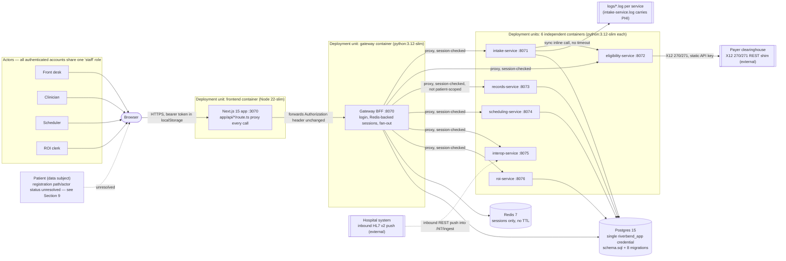

# Baseline Architecture

## Report Metadata

- **Performed:** 2026-07-01, America/New_York (EDT)
- **Repository:** `jf-riverbend-portal` (root: `/Users/jorge/Documents/Revature/jf-riverbend-portal`)
- **Branch / commit:** `jf-initial-analysis` @ `c9eb1e2`
- **Scope:** Whole repository, current state only. Target-state architecture was not requested for this report (the user gave the same current-state-only instruction for the two prior analysis reports produced earlier today — `context-map-07-01-2026.md` and `system-audit-07-01-2026.md` — and this report follows the same scoping rather than re-asking).
- **Evidence type:** Repository/static evidence only. No service was started, no external system (payer clearinghouse, hospital feed) was contacted, and no live deployment environment was inspected — the only environment that exists to inspect is this repository's Docker Compose definition.
- **Limitations:** Deployment/operations facts (Section 8) beyond `docker-compose.yml` are Claimed (from `ARCHITECTURE.md`) or Unknown, not independently Observed, since no live clinic-VM deployment was available.

## 1. Scope and Evidence

**Reviewed:** `frontend/` (Next.js app, incl. `app/lib/gateway.ts`, `app/api/*/route.ts`, `Dockerfile`), all six domain services plus `gateway` (each service's `app.py`, `config.py`, and for several also `db.py`/`models.py`/`logging_config.py`/`security.py`/`book.py`/`check.py`/`Dockerfile`), `db/schema.sql` and the `db/migrations/00N_*.sql` filename sequence (contents of individual migrations were not diffed line-by-line beyond `001`-`008`'s presence and naming), `config/roles.yaml`, `docker-compose.yml`, `.env.example` (`.env` itself was inspected only structurally — key names and whether values differ from placeholders — never its secret contents), `.github/workflows/ci.yml`, `Makefile`, `tests/` (all unit test files read; the integration test file read but not executed), `adr/0001-0003`, `README.md`, `ARCHITECTURE.md`, `docs/handover/jira-tickets.md`, `docs/handover/auditor-questionnaire.md`.

**Excluded:** `docs/temp` (a scenario/roleplay document, not architecture evidence — excluded from this report as from the prior two), `docs/handover/portal.har`, `docs/handover/breach-response-policy.md`, `docs/handover/payer-status-page.md` (referenced in the earlier context map, not re-read for this baseline), any live/deployed environment (none was available), dependency CVE status.

**Version/commit:** `c9eb1e2` on branch `jf-initial-analysis`, matching the two prior reports produced today — no code changed between reports.

**Comparison source:** None. `docs/analysis/` contains no prior `baseline-architecture-*.md`; this is the first baseline for this repository.

## 2. Executive Overview

The Riverbend Patient Portal is a patient intake and clinical-records system for Riverbend Community Health, a multi-clinic community health network. It follows a backend-for-frontend (BFF) pattern: a single Next.js application is the only browser-facing surface, and it proxies everything to a FastAPI gateway, which in turn fans requests out to six single-purpose FastAPI domain services (intake, eligibility, records, scheduling, interop, ROI), all backed by one Postgres 15 database and a Redis instance used solely for session storage. The whole system is defined as one Docker Compose stack; per `ARCHITECTURE.md`, the claimed production topology is the same stack deployed once per clinic region, though this repository contains no evidence (CI/CD deploy step, IaC) of how that actually happens.

Architecturally, the system is small, consistent, and deliberately simple — every domain service repeats the same five-or-six-file module layout by hand (no shared library), and the contractor who built it (Helix Digital Partners, per every ADR's authorship line) left the codebase unusually well-annotated with its own known limitations (explicit `DEBT D#` code comments, matching ADR consequences, and a real Jira ticket trail). The most consequential architectural characteristic is that trust is concentrated entirely at the gateway by convention, not by enforcement: the six domain services perform no authentication or authorization of their own, and `docker-compose.yml` publishes every one of their ports to the host alongside the gateway's — so the "gateway is the only entry point" description in `ARCHITECTURE.md` §1 holds only insofar as nothing else calls a domain service directly.

## 3. Delta Since Previous Baseline

Not applicable — first baseline-architecture report for this repository.

## 4. System Diagram

Every domain service is drawn inside one deployment-unit box because each is built and deployed as its own container from its own `Dockerfile`, but none authenticate calls independently — the box represents build/deploy independence, not a trust boundary of its own (see Section 7).

## 5. Component Inventory

| Component | Responsibility | Interfaces | Data Owned | Dependencies | Deployment Unit | Evidence |
|---|---|---|---|---|---|---|
| `frontend/` | Browser-facing UI; pure proxy for all API calls | `app/api/*/route.ts` (login, logout, me, intake, patients, records, records/search, slots, appointments (+cancel), roi/requests (+fulfill)) | None — stateless proxy | Gateway (`GATEWAY_URL`) | Own container, Node 22-slim, `Dockerfile` bakes `GATEWAY_URL=http://gateway:8070` at build time (also overridable at runtime via compose) | Observed (`frontend/app/lib/gateway.ts`, `frontend/Dockerfile`) |
| `services/gateway` | BFF: login, session issuance/validation, request fan-out to all six domain services | `POST /login`, `POST /logout`, `GET /me`, plus one proxy route per domain function (see `services/gateway/app.py`) | `users` (read), Redis session hashes | Postgres (`users`), Redis, all six domain services (via `INTAKE_URL`, etc.) | Own container, python:3.12-slim | Observed |
| `services/intake-service` | Registration, insurance capture, consent, inline eligibility trigger | `GET /intake/config`, `POST /intake` | `patients`, `insurance_coverages`, `consents` | Postgres, `eligibility-service` (synchronous, inline) | Own container | Observed |
| `services/eligibility-service` | Payer eligibility check | `GET /eligibility` | None (stateless call-through) | External payer clearinghouse via `PAYER_API_URL`/`PAYER_API_KEY` | Own container | Observed |
| `services/records-service` | Patient/chart read façade | `GET /patients`, `GET /patients/{id}`, `GET /patients/{id}/records`, `GET /records/search` | `patients` (read), `encounters`, `records` | Postgres | Own container | Observed |
| `services/scheduling-service` | Slot search, booking, cancellation | `GET /slots`, `GET /appointments`, `POST /appointments`, `POST /appointments/{id}/cancel` | `providers`, `slots`, `appointments` | Postgres (via raw psycopg2 in `book.py`, and presumably SQLAlchemy elsewhere in the service — `book.py` specifically bypasses the ORM) | Own container | Observed |
| `services/interop-service` | Inbound HL7 v2 ingestion from the hospital feed | `POST /hl7/ingest`, `GET /hl7/sample` | None — parses to an internal shape only, does not itself write to Postgres | None beyond the inbound HTTP caller (gateway) | Own container | Observed |
| `services/roi-service` | Release-of-information request intake and fulfillment | `GET /roi/requests`, `POST /roi/requests`, `POST /roi/requests/{id}/fulfill`, `GET /disclosures/{patient_id}` | `roi_requests`, `disclosures`; reads `records`, `patients` | Postgres | Own container | Observed |
| Postgres 15 | System of record for all relational/domain data | SQL, one shared `riverbend_app` credential for every service | `users`, `patients`, `insurance_coverages`, `providers`, `slots`, `appointments`, `encounters`, `records`, `consents`, `audit_logs`, `roi_requests`, `disclosures` | None (leaf) | `postgres:15` image, compose-managed volume `pgdata` | Observed (`db/schema.sql`, `docker-compose.yml`) |
| Redis 7 | Session storage only | Redis protocol, `session:<token>` hash keys | Session records (username, role) keyed by opaque token | None (leaf) | `redis:7` image | Observed |
| `logs/<service>.log` (per service) | Operational logging via Python's `logging` module, file handler | N/A (filesystem) | Log lines; `intake-service.log` specifically contains full PHI payloads at INFO | None | Written into the repo-relative `logs/` directory from inside each container's filesystem (not a named compose volume — persistence across container recreation is Unknown) | Observed (`services/intake-service/logging_config.py`, `app.py:65`) |
| Payer clearinghouse | External vendor; X12 270/271 eligibility responses | HTTPS REST (`PAYER_API_URL`), static bearer API key | External — Riverbend does not own this data store | None (external) | External SaaS/vendor, not part of this deployment | Observed as a call target (`services/eligibility-service/check.py`); vendor identity itself is Claimed only (prior context-map exploration found "ACME Clearinghouse" named against a placeholder domain in `docs/handover/payer-status-page.md`, not independently re-verified in this pass) |
| Hospital HL7 v2 feed | External source system for ADT/ORU clinical events | Inbound HTTP `POST /hl7/ingest` (JSON-wrapped raw HL7 text) — **not** an outbound connection to the `HL7_FEED_HOST`/`HL7_FEED_PORT` declared in `.env.example`, which are unused | External | None (external) | External hospital system, not part of this deployment | Observed (mechanism); the declared env vars' purpose is Unknown (dead config or stale design — unresolved in both prior reports) |

## 6. Critical Workflows

**Patient intake with insurance eligibility (synchronous, request/response):**
Browser → `frontend` (`app/api/intake/route.ts`) → `gateway POST /intake` (session-checked) → `intake-service POST /intake`, which (a) logs the full request body including PHI to `logs/intake-service.log` at INFO, (b) inserts a new `patients` row with no duplicate-match check, and (c) — if insurance was supplied — calls `eligibility-service` synchronously inline (a hardcoded `time.sleep(4.2)` plus an additional no-timeout HTTP call), which itself calls the external payer clearinghouse with no timeout/retry. The entire chain runs on one request thread; a slow or down payer blocks patient registration end-to-end. This is a request/response workflow with no asynchronous or queued step anywhere in the chain.

**Chart access (synchronous, read):**
Browser → `frontend` (`app/api/records/route.ts`) → `gateway GET /patients/{id}/records` (session-checked, **not** patient-scoped) → `records-service`, which assembles a patient's encounters and, per encounter, a separate query for that encounter's records (N+1 pattern, no join), and returns the full chart including free-text clinical notes.

**Appointment booking (synchronous, check-then-insert with no locking):**
Browser → `frontend` → `gateway POST /appointments` (session-checked) → `scheduling-service`, which checks `slot_taken()` and, if false, sleeps 50ms and inserts a new `appointments` row — with no transaction, no `UNIQUE` constraint on `slot_id`, and no idempotency key, so two near-simultaneous or retried requests for the same slot can both succeed.

**Release of information (synchronous, read + write):**
Browser → `frontend` → `gateway POST /roi/requests/{id}/fulfill` (session-checked) → `roi-service`, which marks the request fulfilled, writes one `disclosures` row (with no authorization/purpose/restriction linkage), and returns the patient's full record set to be handed to the requesting recipient — with no verification that a signed authorization exists.

**Inbound HL7 ingestion (asynchronous relative to the hospital's own system, but synchronous HTTP from the gateway's perspective):**
Hospital system → `gateway POST /hl7/ingest` → `interop-service`, which parses only PID/PV1 segments (dropping AL1/RXA) and returns a parsed record — `interop-service` does not itself persist to Postgres in the code reviewed; downstream persistence of HL7-derived data was not traced further in this pass (Unknown whether/how a parsed HL7 record becomes a `patients`/`encounters` row).

No message queue, event bus, or scheduled batch job was found anywhere in the repository — every cross-service interaction observed is a synchronous HTTP request/response.

## 7. Data and Trust Boundaries

- **Browser ↔ frontend:** Public internet boundary. Session token issued by the gateway is stored in browser `localStorage` and attached as `Authorization: Bearer <token>` on every call (`frontend/app/lib/gateway.ts`).
- **Frontend ↔ gateway:** The frontend forwards the `Authorization` header unchanged and does no authentication of its own (`gatewayHeaders()` in `gateway.ts`) — the frontend container itself holds no session-validation logic.
- **Gateway ↔ browser (session boundary):** `require_session` (`services/gateway/app.py`) validates a token against Redis before allowing any non-public route. This boundary authenticates ("is a logged-in staff member") but does not authorize per-resource — it does not bind a session to the specific `patient_id` (or ROI request) being accessed.
- **Gateway ↔ domain services:** Plain HTTP, no service identity, no signed request, no mTLS — every domain service trusts any caller that can reach it. `docker-compose.yml` publishes each domain service's port to the host in addition to the gateway's, so this boundary is a code-level convention (the frontend/gateway only ever calls the gateway) rather than a network-enforced one.
- **Services ↔ Postgres:** Every service that touches the database uses one shared `riverbend_app` credential (`docker-compose.yml` `env_file: .env` on each service) — there is no per-service least-privilege database access.
- **Gateway ↔ Redis:** Session hashes with no TTL — a valid session, once issued, remains valid indefinitely.
- **intake-service ↔ filesystem log:** PHI (name, DOB, SSN, free-text notes) is written in full to `logs/intake-service.log` at INFO — a data-flow boundary distinct from, and less controlled than, the database itself.
- **eligibility-service ↔ payer clearinghouse:** External vendor boundary; a static API key is sent as a bearer token with every call; no mutual TLS or additional verification observed.
- **Hospital feed ↔ interop-service:** External source boundary; inbound push with no described authentication on the `/hl7/ingest` endpoint itself (it inherits only the gateway's generic session check when reached via the gateway — but like every other domain service, `interop-service` performs no authentication check of its own if reached directly).
- **Secrets:** `.env` (containing real, non-placeholder `DB_PASSWORD`, `PAYER_API_KEY`, and `SESSION_SECRET` values, confirmed structurally without reading the values themselves) is tracked in git, not listed in `.gitignore`, and has been present since the initial commit.
- **Backups:** No backup configuration, snapshot policy, or retention documentation was found anywhere in the repository. This is an Unknown, not a confirmed absence of backups in whatever real environment this runs in — but nothing in-repo documents one.

## 8. Deployment and Operations

- **Environments:** Repository evidence describes exactly one deployment shape: a single `docker-compose.yml` stack (Postgres, Redis, gateway, six domain services, frontend). `ARCHITECTURE.md` states (Claimed, not independently verified) that "production" is this same stack run on a single VM per clinic region. No staging environment, no environment-specific compose overrides, and no infrastructure-as-code (Terraform/Kubernetes/Helm) were found.
- **Scaling model:** Unknown/not applicable to current evidence — each service is a single container with no replica count, autoscaling config, or load balancer definition found. The architecture is not currently designed for horizontal scaling (e.g., Redis session storage and the shared DB credential don't preclude it, but nothing in the repo configures it).
- **Availability dependencies:** The gateway depends on Postgres (healthcheck-gated `depends_on`) and Redis (`service_started`, not health-gated) and four of six domain services being started (`intake`, `records`, `scheduling`, `roi` — per `docker-compose.yml`'s `depends_on` block on the `gateway` service; `eligibility-service` and `interop-service` are not in the gateway's `depends_on` list, though the gateway does call them). Each domain service that touches Postgres depends on it being healthy first. There is no documented failover for Postgres or Redis — both are single-instance.
- **Recovery:** `docs/runbook.md` exists and was not read in full for this baseline (out of the reviewed-file list above); its contents were not independently verified here. No automated backup/restore tooling was found in the repository itself.
- **Monitoring/observability:** Only per-service application logs (`logging_config.py` → console + file handler) were found. No metrics, tracing, or alerting configuration (e.g., Prometheus, OpenTelemetry) was found anywhere in the repository.
- **CI/CD:** `.github/workflows/ci.yml` builds the frontend, import-smoke-tests each Python service, runs the unit test suite only (`pytest -m "not integration"` — the integration suite that exercises live auth/IDOR behavior never runs in CI), and runs `docker compose build`. No deploy step, no image push to a registry, and no dependency/image/secret scanning were found.
- **Ownership:** No `CODEOWNERS` file and no internal Riverbend team name appear anywhere in the repository. Every ADR's author line reads "Helix Digital Partners" (the contractor). Service/table ownership is described functionally in `ARCHITECTURE.md` §2, but no individual or team is named as the current internal owner of any part of the system.

## 9. Constraints, Debt, and Unknowns

**Confirmed constraints/debt** (descriptive summary; see `docs/analysis/system-audit-07-01-2026.md` for severity and remediation — cross-referenced by finding ID where applicable):
- No service-to-service authentication between gateway and domain services; all domain-service ports are also published to the host (AUD-01).
- Sessions never expire, single flat `staff` role, no MFA (AUD-05, AUD-13).
- Chart-read access is not scoped to a specific patient (AUD-02).
- ROI fulfillment has no signed-authorization check and cannot produce a real accounting of disclosures (AUD-03).
- PHI is logged in full, in plaintext, on every intake request (AUD-06).
- `audit_logs` is a mutable, soft-deletable table, not a tamper-evident trail (AUD-07).
- Real credentials are committed to git history (AUD-08).
- No master-patient-index; duplicate patient charts are possible and have occurred (AUD-09).
- The HL7 parser silently drops allergy/medication segments (AUD-04).
- The payer eligibility call is synchronous with no timeout, sitting inline on the intake critical path (AUD-11).
- Scheduling has an unguarded check-then-insert double-booking race (AUD-14).
- All services share a single Postgres credential (AUD-15).
- CI has no dependency/image/secret scanning and never runs the integration test suite (AUD-10, AUD-16).
- No shared Python library across services — each repeats the same module layout by copy-paste (`adr/0001`), a maintainability constraint distinct from any single security/correctness finding above.

**Inferred:**
- Downstream persistence of HL7-derived data was not traced past `interop-service`'s parse-and-return response in the code reviewed; whether/how a parsed HL7 record becomes a `patients`/`encounters`/`records` row elsewhere in the system was not established in this pass.
- The `providers`/`slots` data appears to be seeded/static rather than fed by any external scheduling system — no integration or sync mechanism for provider/slot data was found, only `db/seed/*.csv`.

**Unknown:**
- Whether patients have (or are intended to have) an independent registration/login path distinct from staff-assisted intake — the gateway requires a staff-style session on every non-public route including `/intake`, yet `README.md` describes patients as "self-registering," and only staff accounts exist in seed data. Carried over from the prior context-map report, still unresolved.
- Whether `HL7_FEED_HOST`/`HL7_FEED_PORT` reflect a planned real-time hospital feed listener or stale/abandoned config.
- The real deployment topology and network configuration of the claimed "one VM per clinic region" production environment — not observable from this repository.
- Backup/retention policy for Postgres, Redis, and the `logs/` directory.
- Whether `docs/runbook.md`'s recovery procedures (not read in full for this baseline) are consistent with the architecture described here.
- Actual identity and contractual/BAA status of the payer clearinghouse vendor.

## 10. Questions and Recommended Next Analysis

- Confirm the patient-registration/actor model (staff-assisted vs. independent patient login) with whoever at Riverbend owns product/ops decisions — this materially changes the actor model in Section 4's diagram and was left unresolved by the companion context map as well.
- Read `docs/runbook.md` in full and reconcile it against this baseline's Deployment and Operations section (Section 8) — it was not read for this report and may contain recovery/operational detail this baseline currently marks Unknown.
- Trace HL7-derived data persistence beyond `interop-service`'s parse step to confirm whether/how it reaches Postgres, closing the Inferred item in Section 9.
- Obtain or request evidence of the actual clinic-VM deployment's network configuration to determine whether the domain-service trust-boundary gap (Section 7) is mitigated in the real environment, independent of what `docker-compose.yml` alone shows — the same open question already raised in `docs/analysis/system-audit-07-01-2026.md` (AUD-01) and its companion plan.
- Resolve `HL7_FEED_HOST`/`HL7_FEED_PORT` intent — same open question shared across all three analysis reports produced today; resolve once, not three times.
