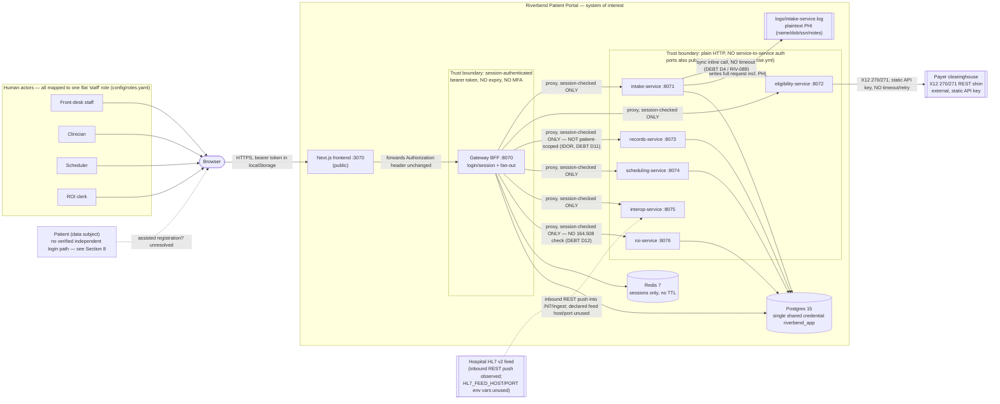

# Context Map

## Report Metadata

- **Performed:** 2026-07-01, America/New_York (EDT)
- **Repository:** `jf-riverbend-portal` (root: `/Users/jorge/Documents/Revature/jf-riverbend-portal`)
- **Branch / commit:** `jf-initial-analysis` @ `c9eb1e2`
- **Selected mode:** System context mode
- **State represented:** Current state only (no target-state proposals in this report)
- **Limitations:** Static analysis of the repository only. No service was started and no external system (payer clearinghouse, hospital feed) was contacted. Frontend-to-gateway and gateway-to-service behavior is inferred from source code, not from a live request trace. `docs/handover/portal.har` was not decoded for this report.

## 1. Purpose and Selected Mode

**Scope:** The whole system — the Riverbend Patient Portal monorepo (Next.js frontend, gateway BFF, six FastAPI domain services, Postgres, Redis) plus its external integrations.

**Audience:** The engineering team taking over this contractor handoff, and anyone assessing the system's trust boundaries and PHI exposure before prioritizing remediation work.

**Decision supported:** Understanding what talks to what, where authentication/authorization actually apply versus where they're only asserted in prose, and where PHI crosses a boundary — as a prerequisite to any remediation or audit work.

**Mode interpretation:** System context mode was selected (actors, system boundary, external systems, trust boundaries, sensitive-data flows). DDD context mode was not used — the request was explicit that this report covers system context, current state only. Target-state design is out of scope for this report.

**First report:** `docs/analysis/` was empty before this run (only a non-tracked `.DS_Store` was present). There is no prior context map to diff against — Section 3 is empty by inspection.

## 2. Evidence and Confidence

Evidence read directly during this analysis (all file paths relative to repo root):

- `README.md`, `ARCHITECTURE.md` — architecture diagram, service table, request lifecycle, §7 known-limitations list.
- `adr/0001-monorepo-and-stack.md`, `adr/0002-data-and-compliance.md`, `adr/0003-authentication-and-sessions.md`.
- `config/roles.yaml`, `services/gateway/app.py`, `services/gateway/auth.yaml`, `services/gateway/security.py` (session/auth mechanics).
- `docker-compose.yml`, `.env.example` (topology, published ports, env vars — `.env` itself was not read or modified).
- `db/schema.sql` (full schema read directly).
- `services/intake-service/app.py`, `services/intake-service/logging_config.py`.
- `services/records-service/app.py`, `services/roi-service/app.py`, `services/eligibility-service/check.py`, `services/interop-service/app.py`, `services/scheduling-service/book.py`.
- `tests/README.md`, `pytest.ini`, `.github/workflows/ci.yml`, `Makefile`, `frontend/package.json`.
- `docs/handover/jira-tickets.md`, `docs/handover/auditor-questionnaire.md` (summarized via prior exploration in this session; ticket IDs cross-checked against in-code debt comments).
- `git log` (commit history, including the added-then-removed `ai-orchestrator` service).

**Confidence classification:**

| Relationship / fact | Classification | Basis |
|---|---|---|
| Browser → frontend → gateway → domain services → Postgres/Redis topology | Observed | Read directly in `docker-compose.yml`, `services/gateway/app.py`, service `app.py` files |
| Gateway session check does not scope to `patient_id` (IDOR) | Observed | `services/gateway/app.py` lines 136-140 and `services/records-service/app.py` lines 86-98, both self-documented as DEBT D11 |
| PHI (name/dob/ssn/notes) written in full to `logs/intake-service.log` at INFO | Observed | `services/intake-service/app.py` line 65 (`log.info('POST /intake body=%s', ...)`), `services/intake-service/logging_config.py` |
| Sessions never expire, no MFA, single flat `staff` role | Observed | `services/gateway/auth.yaml`, `config/roles.yaml`, `db/schema.sql` (`users.role` comment) |
| Payer eligibility call is synchronous, no timeout, inline on `/intake` | Observed | `services/eligibility-service/check.py` line 17, `services/intake-service/app.py` lines 138-154 (DEBT D4 / RIV-088) |
| HL7 ingestion is inbound REST push; parser drops AL1/RXA | Observed | `services/interop-service/app.py`, DEBT D6 comment |
| ROI fulfillment has no 45 CFR 164.508 authorization check and no true accounting-of-disclosures | Observed | `services/roi-service/app.py` lines 83-170, DEBT D12 comment, `db/schema.sql` `roi_requests`/`disclosures` tables (no `authorization_id` column) |
| No service-to-service authentication between gateway and domain services; all service ports also published to host | Observed | `docker-compose.yml` (`ports:` on every service), absence of any auth header/check in domain-service `app.py` files |
| Single shared Postgres credential (`riverbend_app`) across all services | Observed | `docker-compose.yml` (`env_file: .env` on every service, one `POSTGRES_USER`) |
| `.env` is tracked in git, not gitignored | Observed | `.gitignore` contents (no `.env` entry) |
| README's "fully HIPAA compliant / all PHI encrypted" claim | Claimed (contradicted) | `README.md` line 1 and "Compliance" section, directly contradicted by `adr/0002` and `ARCHITECTURE.md` §7 |
| Auditor could not get an accounting of disclosures / per-patient access log when asked | Claimed | `docs/handover/auditor-questionnaire.md` (summarized in this session's prior exploration, not re-read verbatim in this pass) |
| AWS Bedrock "AI summary" (`ai-orchestrator`) service | Historical / decommissioned | `git log` shows it added in `2a5039d` and removed in `d0905a1`; not present in current tree — included only as a footnote, not a live node |
| Patients are self-registering, first-class actors vs. staff-assisted-only registration | **Unresolved / inferred** | README says "Patients self-register," but the gateway's `/intake` proxy requires `require_session` (i.e., a *staff* login) for every non-public route, and the only seeded user accounts are staff (`frontdesk`, `drnguyen`, `roiclerk`, `mokonkwo`) with no patient-role accounts found. No distinct patient-authentication code path was found. Treated in this map as staff-assisted registration; flagged as a gap in Section 8 rather than asserted either way |
| `HL7_FEED_HOST` / `HL7_FEED_PORT` intent | Unknown | Declared in `.env.example`, not referenced by any code path found (actual ingestion is inbound REST `POST /hl7/ingest`) |

## 3. Delta Since Previous Context Map

Not applicable — this is the first context map produced for this repository. `docs/analysis/` contained no prior `context-map-*.md` file.

## 4. Context Diagram

**Legend:**
- Solid arrows = observed, code-level relationships.
- Dashed arrows = unresolved or inferred relationships (see Section 2/8).
- Boxes labeled "Trust boundary" mark points where authentication/authorization is claimed; annotations on individual edges note where that claim is incomplete (e.g., session-checked but not patient-scoped).
- Double-bracket nodes (`[[ ]]`) are external systems outside Riverbend's system boundary.

## 5. Actors, Contexts, and Systems

- **Front-desk staff, Clinician, Scheduler, ROI clerk** — four functional personas described in `README.md`, but the system enforces no distinction between them: every account maps to the single `staff` role (`config/roles.yaml`, `db/schema.sql`). Owner: Riverbend Community Health (operates the portal); the system doesn't itself own role differentiation today.
- **Patient** — the data subject of nearly every record in the system, but not a verified independent system principal. README describes "self-register," but no patient-login code path or patient-role account was found; only staff accounts exist. See Section 8.
- **Next.js frontend (:3070)** — the only browser-facing entry point. Pure proxy layer: every `app/api/*/route.ts` handler forwards the caller's bearer token to the gateway unchanged (per prior exploration of `frontend/app/lib/gateway.ts`).
- **Gateway BFF (:8070)** — owns login, session issuance/validation (Redis-backed), and fans out to all six domain services. Per `services/gateway/app.py`'s own module docstring, it forwards the session but never re-validates it against the specific resource being requested.
- **intake-service (:8071)** — registration, insurance capture, consent, and (inline) eligibility trigger. Owns `patients`, `insurance_coverages`, `consents` tables.
- **eligibility-service (:8072)** — payer eligibility check (X12 270/271 shim). Owns no tables; calls out to the payer.
- **records-service (:8073)** — read façade for patient demographics and charts. Owns `patients` (read), `encounters`, `records`.
- **scheduling-service (:8074)** — slot search, booking, cancellation. Owns `providers`, `slots`, `appointments`.
- **interop-service (:8075)** — inbound HL7 v2 ingestion from the hospital feed. Owns no tables; parses to an internal shape only.
- **roi-service (:8076)** — release-of-information request intake and fulfillment. Owns `roi_requests`, `disclosures`; reads `records`.
- **Postgres 15** — single system of record for all relational data, one shared `riverbend_app` credential used by every service that touches the DB.
- **Redis 7** — session store only (`session:<token>` → username/role), no TTL set.
- **Payer clearinghouse** — external vendor for X12 270/271 eligibility responses; referenced generically via `PAYER_API_URL`/`PAYER_API_KEY`, no vendor name found in code (prior exploration noted `docs/handover/payer-status-page.md` refers to it as "ACME Clearinghouse" against a placeholder domain `edi.example.com`).
- **Hospital HL7 v2 feed** — external source system for ADT/ORU messages; the actual observed mechanism is an inbound REST `POST /hl7/ingest` call into `interop-service`, not an outbound socket connection to the `HL7_FEED_HOST`/`HL7_FEED_PORT` declared in `.env.example` (those variables are unused in code found).
- **AWS Bedrock "AI summary" (`ai-orchestrator`)** — historical only. Added in commit `2a5039d`, fully removed in `d0905a1` before this handoff baseline. Not a current node; noted so it isn't mistaken for a live integration.

**Ownership note:** No `CODEOWNERS` file and no internal Riverbend team names appear anywhere in the repo. Every ADR lists "Author: Helix Digital Partners" (the contractor). Ownership of each service/table area is described functionally in `ARCHITECTURE.md` §2, but no internal owning team is named for any of it.

## 6. Relationship Catalog

| # | From → To | Purpose | Mechanism | Data | Trust boundary | Failure implication |
|---|---|---|---|---|---|---|
| 1 | Browser → Next.js frontend | Load portal UI, submit forms | HTTPS, bearer token kept in `localStorage` | All patient/PHI data the UI displays | Public internet boundary | Token theft (XSS or device access) grants full session privileges with no expiry |
| 2 | Frontend → Gateway | Proxy every API call | HTTP, `Authorization: Bearer <token>` forwarded unchanged | Same as above | Session-authenticated boundary (but see #3) | Any valid session token — regardless of whose — is accepted for any proxied call |
| 3 | Gateway → records-service | Fetch patient chart | HTTP, `require_session` dependency (login check only) | Full chart: encounters, records, notes | **Not patient-scoped** — DEBT D11 (IDOR) | Any authenticated user can read any patient's chart by walking sequential IDs |
| 4 | Gateway → roi-service | Create/fulfill ROI requests | HTTP, `require_session` only | Patient records disclosed to a named recipient | Session-checked only; no 45 CFR 164.508 check downstream — DEBT D12 | PHI can be released to any named recipient with no authorization verification and no true accounting-of-disclosures |
| 5 | Gateway → intake/eligibility/scheduling/interop-service | Proxy registration, eligibility, booking, HL7 ingest | HTTP, `require_session` only | Registration payload, booking details, HL7 messages | Session-checked only | Standard proxy risk; no resource-level authorization gaps documented beyond the login check itself |
| 6 | Gateway → domain services (all six) | Internal fan-out | Plain HTTP, no service identity/auth | — | **No service-to-service authentication** — any of the six services (or anything else with network access) trusts a bare HTTP call | A compromised or misconfigured client on the compose network could call a domain service directly, bypassing the gateway entirely — reinforced by every service's port also being published to the host |
| 7 | intake-service → eligibility-service | Verify insurance during registration | HTTP, synchronous, `time.sleep(4.2)` + no-timeout `httpx.get` — DEBT D4 / RIV-088 | Insurance member ID | Internal, no auth | A hung/slow eligibility call blocks the entire `/intake` request thread |
| 8 | eligibility-service → Payer clearinghouse | X12 270/271 eligibility check | HTTPS REST, static bearer API key, **no timeout, no retry, no cache** | Insurance member ID, plan lookup | **External vendor boundary** | Payer outage or slowness directly freezes patient intake (RIV-141) |
| 9 | Hospital HL7 v2 feed → interop-service | Inbound ADT/ORU ingestion | HTTP `POST /hl7/ingest` (JSON-wrapped raw HL7 text) | Patient demographics + encounter data; **allergy (AL1) and medication (RXA) segments are silently dropped** — DEBT D6 | External source boundary | Downstream charts can be missing allergy/medication data with no visible error |
| 10 | intake-service → `logs/intake-service.log` | Operational logging | File handler, INFO level | **Full request body including name/dob/ssn/notes, in plaintext** — DEBT D1 | Internal — but this is a PHI-at-rest exposure in a location with no documented access control | Anyone with filesystem/log access reads PHI in plaintext outside the DB |
| 11 | All DB-touching services → Postgres | Persist/read domain data | SQLAlchemy / raw psycopg2, single shared `riverbend_app` credential | All PHI and operational data | No per-service least privilege | A vulnerability in any one service's DB access effectively grants access to every table in the database |
| 12 | Gateway → Redis | Session storage | Redis protocol, no TLS noted | Username + role per session, keyed by token | Internal | Session hijack via Redis access has no time bound (no TTL) |
| 13 | scheduling-service → Postgres (booking) | Check-then-insert slot booking | Raw psycopg2, `slot_taken()` then `insert_appointment()`, no `UNIQUE` constraint, no lock | Appointment/slot data | Internal | Two near-simultaneous bookings can double-book the same slot (RIV-175) |

## 7. Critical Flow Walkthrough

**Flow A — Patient intake with insurance eligibility (validates the external-integration + PHI-logging risk):**
1. Front-desk staff submits the intake form in the browser → `POST` to the Next.js frontend → forwarded with the staff member's bearer token to `gateway POST /intake` (relationship #2).
2. Gateway's `require_session` confirms the token is valid (any staff session works — no finer-grained check) and proxies to `intake-service POST /intake` (relationship #5/#6).
3. `intake-service` immediately logs the full request body — including the patient's name, DOB, SSN, and notes — to `logs/intake-service.log` at INFO (relationship #10, DEBT D1), then inserts a new `patients` row with no duplicate-match check (DEBT D5).
4. If insurance was supplied, `intake-service` calls `eligibility-service` synchronously and inline, with a hardcoded 4.2s delay standing in for the real round-trip and no timeout on the HTTP call itself (relationship #7, DEBT D4/RIV-088).
5. `eligibility-service` calls the external payer clearinghouse over HTTPS with a static API key and no timeout/retry (relationship #8) — if the payer is slow or down, this hangs and freezes the whole intake request (RIV-141).
6. Response propagates back through the same chain to the browser.

This flow is coherent with the map: it confirms the gateway-as-single-entry-point pattern, the PHI-logging exposure, and the synchronous external dependency that sits on a user-facing critical path.

**Flow B — Chart access and the IDOR gap:**
1. Any staff user, logged in via any of the four demo personas, requests `GET /api/records?patient_id=<N>` from the frontend.
2. The frontend forwards the request with the caller's bearer token to `gateway GET /patients/{N}/records` (relationship #2).
3. `require_session` confirms the token is valid — but never checks whether this particular user should be able to see patient `N` (relationship #3, DEBT D11).
4. Gateway proxies to `records-service`, which assembles the full chart (encounters + records, including clinical notes) with no ownership check of its own (`services/records-service/app.py` lines 86-98) and returns it.

This flow confirms the map's most safety-critical finding: the "session-authenticated boundary" at the gateway is real for authentication but does not extend to authorization for any specific patient's data, for either the records path or (per relationship #4) the ROI disclosure path.

## 8. Gaps, Risks, and Questions

- **Patient actor status is unresolved.** `README.md` states patients "self-register," but every non-public gateway route (including `/intake`) requires a valid staff-style session (`require_session`), and only staff accounts exist in the seed data. It is unclear whether self-service registration is an intended-but-unbuilt feature, is performed by front-desk on the patient's behalf, or relies on a code path not found in this pass. **Recommend confirming with the product owner or a live walkthrough of the registration page before asserting patients as independent system principals in any future revision of this map.**
- **`HL7_FEED_HOST`/`HL7_FEED_PORT` are declared but unused.** Nothing in the repository indicates whether a real-time hospital feed listener is a planned integration or stale leftover config. Flagged as unknown, not decided.
- **Compliance-claim contradiction.** `README.md` asserts full HIPAA compliance and PHI encryption; `adr/0002-data-and-compliance.md` and `ARCHITECTURE.md` §7 describe plaintext PHI columns, no MFA, non-expiring sessions, and no per-service authorization. This report does not certify compliance status either way — it records that the two documents in the same repository disagree.
- **No internal ownership is established.** No `CODEOWNERS`, no named internal team in any doc — every ADR is contractor-authored. Any remediation-prioritization conversation needs to first establish who inside Riverbend owns which service area.
- **Service-to-service trust is asserted but not enforced.** `ARCHITECTURE.md` §1 states "the portal never calls a domain service directly," but `docker-compose.yml` publishes every domain service's port to the host alongside the gateway's — the "gateway-only" boundary is a code-level convention (frontend always calls gateway), not a network-level guarantee.
- **This map does not include `docs/temp`.** That file is a scenario/roleplay "client message" document, not architecture evidence, and was excluded as an information source for this report (per explicit scoping for this run). The one factual claim from it that overlapped with real evidence — PHI written to `logs/intake-service.log` — was independently confirmed directly in `services/intake-service/app.py` and `logging_config.py`, and is cited to those files, not to `docs/temp`.
- **This report is not a security, privacy, or compliance certification.** It documents observed relationships and cites known debt markers already present in the codebase (D1, D4, D5, D6, D8, D11, D12) and tracked tickets (RIV-088, RIV-141, RIV-160, RIV-175); it does not itself assess severity or completeness of remediation.
